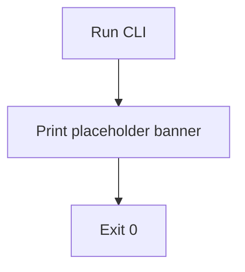

# Application Workflow

## Current State

No business functionality has been implemented yet. There is no user
interaction flow, validation flow, allocation flow, or output flow to
document — inventing one now would mean guessing at business rules that
have not been specified, which this project explicitly avoids.

The CLI entry point (`src/robot_allocation/cli.py`) currently only prints a
placeholder banner and exits successfully:

## What This Document Will Contain

Once the first business requirement is provided, this document will be
expanded to cover, at minimum:

- User interaction / input flow (how input reaches the system — file,
  stdin, arguments, interactive prompts — to be determined by the
  requirement).
- Validation flow (what is checked, and what happens when validation
  fails).
- Allocation/business logic flow (the actual rules — not yet defined).
- Output flow (what is produced, and in what format).
- Error flow (how failures are surfaced to the user).
- Any state transitions relevant to the domain.
- System boundaries (what this application is and is not responsible for).

Each of these will be backed by a Mermaid diagram where it clarifies branching
or state, per the project's documentation conventions.

**This file must be updated in the same change that introduces or modifies
the corresponding behaviour** — see `documentation-workflow.md`.
