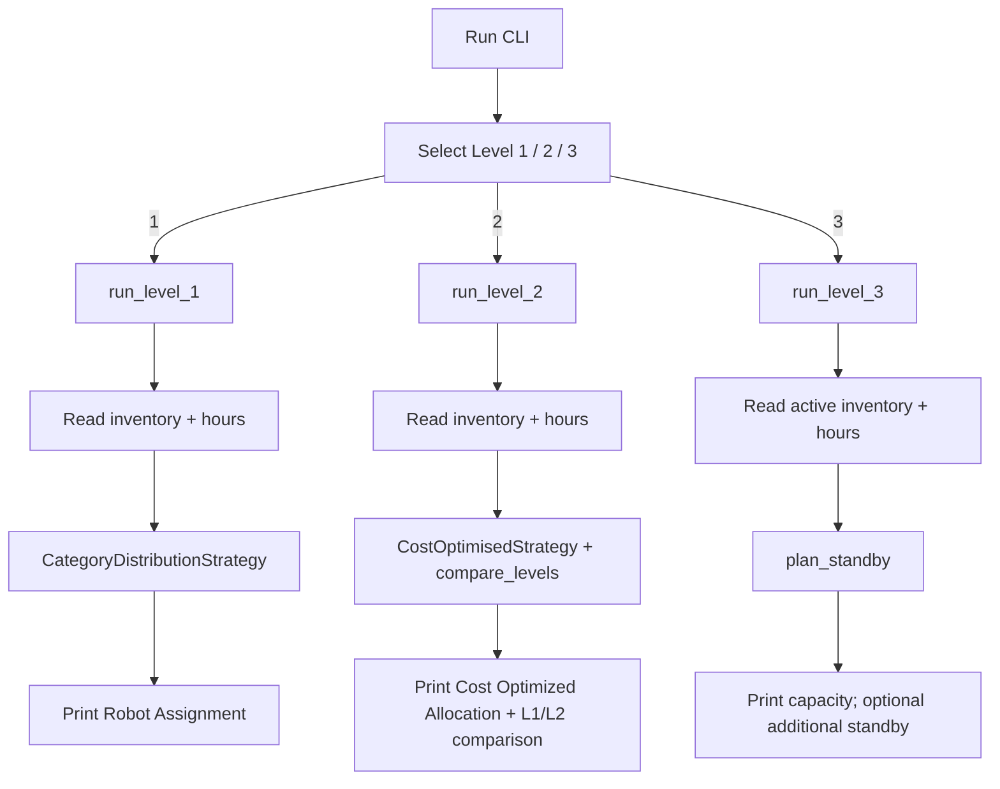

# Application Workflow

## Current State

Levels 1-3 are implemented. The interactive CLI presents a top-level menu to
choose Level 1 (category distribution), Level 2 (cost-optimised + L1/L2
comparison), or Level 3 (standby activation). Each level has a separate runner
so logics do not collide.

## Input flow

1. Prompt `Select allocation level:` with choices 1 / 2 / 3.
2. Prompt `Enter number of robots available:` then `Bravo:`, `Charlie:`, `Delta:`
   (active inventory for all levels; Level 3 does **not** ask for standby stock).
3. Prompt `Enter client work hours:`.
4. Counts must be non-negative integers; hours must be a positive integer.

## Allocation flow

- **Level 1:** mandatory >=1 of each category; min excess then fewest robots.
- **Level 2:** minimise total charging cost; tie-breaks min excess, fewest robots,
  deterministic Delta/Charlie preference. Also best-effort Level 1 comparison.
- **Level 3:** use full active capacity first; if shortfall remains, cost-optimised
  unbounded standby fill of the shortfall only (same objective as Level 2). When
  active capacity covers the request, omit the additional section.

## Output flow

- Level 1: `Robot Assignment` block (all categories).
- Level 2: `Cost Optimized Allocation` + L1 vs L2 comparison (or L1 infeasible).
- Level 3: active capacity + requested hours; optionally the winning additional
  standby lines coloured by robot type (Bravo / Charlie / Delta).

## Error flow

Shared validation errors and level-specific insufficient-capacity abort the run
(exit 1). Level 2 still treats Level 1-only failures as non-fatal for comparison.
Invalid menu choice exits with a clear error.

## System boundaries

- No persistence, no network I/O, no GUI.
- Domain logic (`Allocator` / strategies / `plan_standby`) is separate from CLI I/O.
- No CI/CD added.
