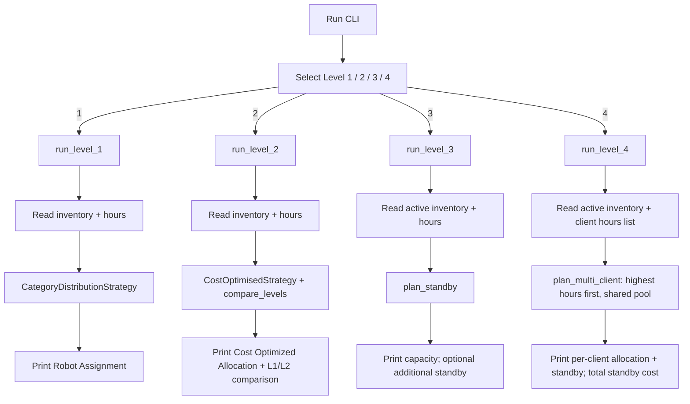

# Application Workflow

## Current State

Levels 1-4 are implemented. The interactive CLI presents a top-level menu to
choose Level 1 (category distribution), Level 2 (cost-optimised + L1/L2
comparison), Level 3 (standby activation), or Level 4 (multi-client allocation).
Each level has a separate runner so logics do not collide.

## Input flow

1. Prompt `Select allocation level:` with choices 1 / 2 / 3 / 4.
2. Prompt `Enter number of robots available:` then `Bravo:`, `Charlie:`, `Delta:`
   (active inventory for all levels; Level 3 does **not** ask for standby stock).
3. Prompt `Enter client work hours:` (Levels 1-3, one value). Level 4 instead
   prompts `Client working hours:` and accepts a single value, comma-separated
   values, or space-separated values — the number of values is the number of
   clients.
4. Counts must be non-negative integers; every hours value must be a positive
   integer, and Level 4 needs at least one value.

## Allocation flow

- **Level 1:** mandatory >=1 of each category; min excess then fewest robots.
- **Level 2:** minimise total charging cost; tie-breaks min excess, fewest robots,
  deterministic Delta/Charlie preference. Also best-effort Level 1 comparison.
- **Level 3:** use full active capacity first; if shortfall remains, cost-optimised
  unbounded standby fill of the shortfall only (same objective as Level 2). When
  active capacity covers the request, omit the additional section.
- **Level 4:** several clients share one active pool, served in descending
  requested hours (ties in input order). A client the remaining pool can cover
  takes a cost-optimised set of those robots; otherwise it takes every remaining
  robot and its shortfall becomes a Level 3 standby recommendation. Assigned
  robots are consumed for the day, so unused hours are excess, not carried over.

## Output flow

- Level 1: `Robot Assignment` block (all categories).
- Level 2: `Cost Optimized Allocation` + L1 vs L2 comparison (or L1 infeasible).
- Level 3: active capacity + requested hours; optionally the winning additional
  standby lines coloured by robot type (Bravo / Charlie / Delta).
- Level 4: shared active capacity + client count, then one block per client in
  service order (labelled by input position) with the robots drawn from the pool
  and any standby lines, then the total standby cost.

## Error flow

Shared validation errors and level-specific insufficient-capacity abort the run
(exit 1). Level 2 still treats Level 1-only failures as non-fatal for comparison.
Invalid menu choice exits with a clear error. Level 4 rejects an empty hours
line or any non-positive/non-integer value with the shared work-hours message,
and never reports insufficient capacity because standby is unbounded.

Both executable entry points use `cli.main()` as the terminal boundary. EOF at
any prompt prints `Error: Input ended before allocation completed.` to stderr and
exits 1. Ctrl+C prints `Allocation cancelled.` to stderr and exits 130, including
when allocation is running. Neither produces a traceback. Restart to try again;
there is no persisted state. Direct runner callers handle termination themselves.

Unbounded standby describes stock availability, not computational scalability.
Large requests can be slow; extremely large integers can overflow the current
floating-point search bounds. These are known implementation limits, not new
business validation rules (see README "Technical Debt" and `solutions.md`).

## System boundaries

- No persistence, no network I/O, no GUI.
- Domain logic (`Allocator` / strategies / `plan_standby` / `plan_multi_client`)
  is separate from CLI I/O; Level 4's input parsing rule lives in the domain
  (`parse_client_hours`), not in the terminal layer.
- No CI/CD added.
