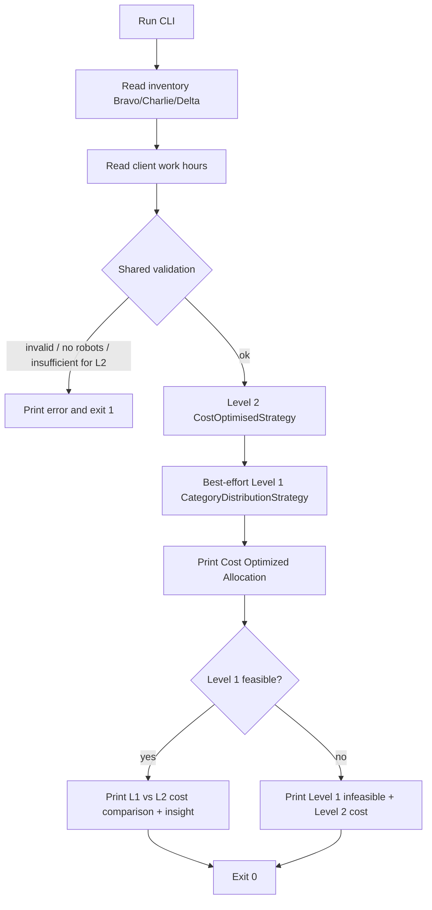

# Application Workflow

## Current State

Levels 1–2 are implemented. The interactive CLI collects inventory and requested
hours, runs Level 2 (cost-optimised) allocation, and compares charging cost
against Level 1 (category distribution).

## Input flow

1. Prompt `Enter number of robots available:` then `Bravo:`, `Charlie:`, `Delta:`.
2. Prompt `Enter client work hours:`.
3. Counts must be non-negative integers; hours must be a positive integer.

## Allocation flow

- **Level 2 (primary):** minimise total charging cost; tie-breaks min excess,
  fewest robots, deterministic Delta/Charlie preference. No diversity mandate.
- **Level 1 (comparison):** mandatory >=1 of each category; min excess then
  fewest robots. See `features/level-1.md`.

## Output flow

1. Level 2 block (`Cost Optimized Allocation`, positive counts only, hours, cost).
2. Comparison block (both costs + difference + insight), or Level 1 infeasible note.

## Error flow

Shared Allocator errors and Level 2 insufficient-capacity abort the run (exit 1).
Level 1-only failures do **not** abort when Level 2 succeeded.

## System boundaries

- No persistence, no network I/O, no GUI.
- Domain logic (`Allocator` / strategies) is separate from CLI I/O adapters.
